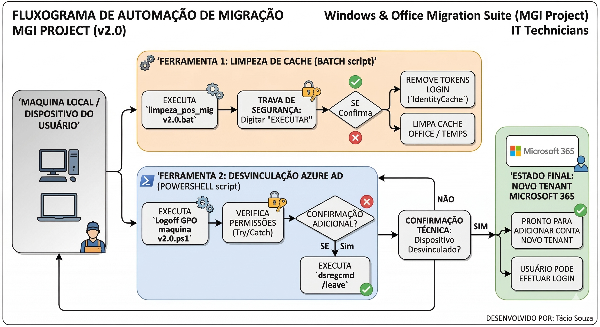

# Windows & Office Migration Suite (MGI Project)

Este repositório contém ferramentas de automação desenvolvidas para otimizar o processo de migração de locatários (*tenants*) Microsoft 365 e a desvinculação de dispositivos Azure AD.

---

##  Destaques das Melhorias (v2.0)

O projeto evoluiu para garantir mais segurança e reduzir falhas humanas durante a operação:

* **Segurança Operacional:** Implementação de travas de confirmação (*Double-Check*) e obrigatoriedade de digitar a palavra-chave **EXECUTAR** para liberar comandos críticos.
* **Robustez:** Uso de `taskkill` para encerrar processos do Office/Teams, evitando erros de "Acesso Negado".
* **UX & Observabilidade:** Interface colorida com sistema de status (Verde para sucesso e Vermelho para erros) e logs detalhados.
* **Eficiência (Anti-Loop):** Uso de **Flags** (marcadores no sistema de arquivos) para impedir que scripts via GPO rodem repetidamente sem necessidade.

---

##  Ferramentas Incluídas

### 1. Limpeza de Cache (Batch)
Focada em resolver problemas de login e licenciamento pós-migração.
* **Ações:** Remove tokens de login (`IdentityCache`/`OneAuth`), limpa o cache temporário do Office e reseta pacotes de autenticação do Windows.
* **Arquivo:** `limpeza_pos_mig v2.0.bat`

### 2. Desvinculação Azure AD (PowerShell)
Assistente para desvinculação segura do registro do Azure AD (`dsregcmd /leave`).
* **Ações:** Realiza verificações de segurança antes da execução e utiliza blocos `try/catch` para capturar falhas de privilégios.
* **Arquivo:** `Logoff trabalho e escola GPO maquina v2.0.ps1`

---

###  Técnico Responsável
**Tácio Souza**
